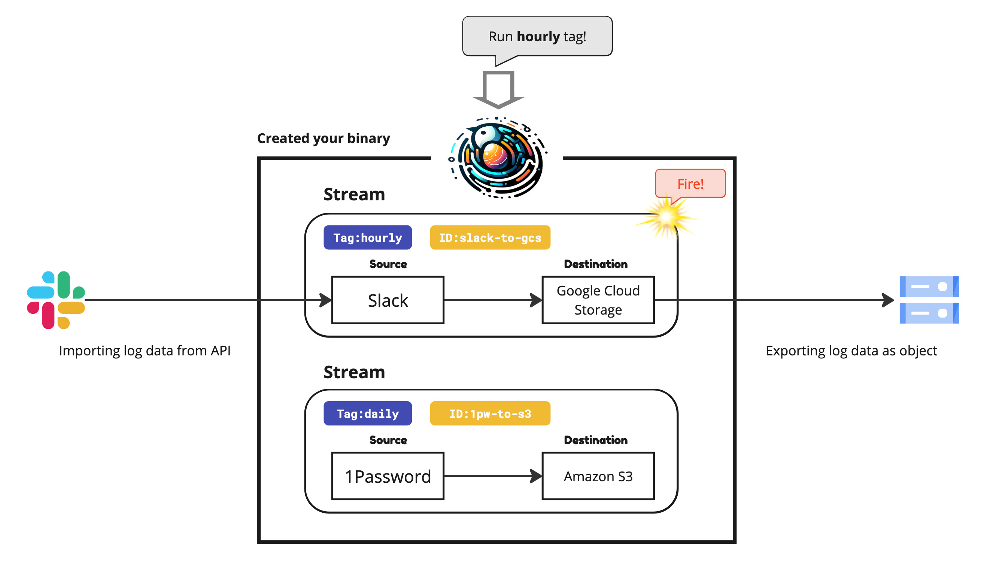

# hatchery

A code-based audit log collector for SaaS services


## Motivation

Many SaaS services offer APIs for accessing data and logs, but managing them can be challenging due to various reasons:

- Audit logs are often set to expire after a few months.
- The built-in log search console provided by the service is not user-friendly and lacks centralized functionality for searching and analysis.

As a result, security administrators are required to gather logs from multiple services and store them in object storage for long-term retention and analysis. However, this process is complicated by the fact that each service has its own APIs and data formats, making it difficult to implement and maintain a tool to gather logs.

`hatchery` is a solution designed to address these challenges by collecting data and logs from SaaS services and storing them in object storage. This facilitates log retention and prepares the data for analysis by security administrators.

## How it works



`hatchery` is not a tool, but SDK. You can build your own binary with `hatchery` SDK and run it on your environment. You can define the source and destination of the data you want to collect, and `hatchery` will handle the data collection and storage for you.

In `hatchery`, the data collection and storage pipeline is called a "stream". A stream consists of a source and a destination. The source is the data provider (e.g., Slack, 1Password, Falcon Data Replicator), and the destination is the data storage (e.g., Google Cloud Storage, Amazon S3). You can define multiple streams and run them in parallel.

A stream has also an ID and tags. The ID is a unique identifier for the stream, and the tags are used to categorize the streams. You can use these identifiers to run specific streams or filter them by tags.

Here is an example of how to define streams according to the above design image.
```go
streams := []*hatchery.Stream{
	hatchery.NewStream(
		// Source: Slack Audit API
		slack.New(secret.NewString(os.Getenv("SLACK_TOKEN"))),
		// Destination: Google Cloud Storage
		gcs.New("mizutani-test"),

		// Identifiers
		hatchery.WithID("slack-to-gcs"),
		hatchery.WithTags("hourly"),
	),

	hatchery.NewStream(
		// Source: 1Password
		one_password.New(secret.NewString(os.Getenv("ONE_PASSWORD_TOKEN"))),
		// Destination: Amazon S3
		s3.New("ap-northeast1", "mizutani-test"),

		// Identifiers
		hatchery.WithID("1pw-to-s3"),
		hatchery.WithTags("daily"),
	),
}
```

You can run hatchery with the streams you defined. The following example shows how to run hatchery as Command Line Tool. It handles the command line arguments and runs the streams you specified.

```go
if err := hatchery.New(streams).CLI(os.Args); err != nil {
	panic(err)
}
```

```bash
$ go build -o myhatchery main.go
$ ./myhatchery -i slack-to-gcs # Run the stream with ID "slack-to-gcs"
$ ./myhatchery -t hourly       # Run the streams with tag "hourly"
```

## Documentation

- About Hatchery
  - [How to Use hatchery](docs/usage.md)
  - [How to Develop Hatchery Extension](docs/extension.md)
- Source
  - [Slack](https://pkg.go.dev/github.com/secmon-as-code/hatchery@main/source/slack)
  - [1Password](https://pkg.go.dev/github.com/secmon-as-code/hatchery@main/source/one_password)
  - [Falcon Data Replicator](https://pkg.go.dev/github.com/secmon-as-code/hatchery@main/source/falcon_data_replicator)
  - [Twilio](https://pkg.go.dev/github.com/secmon-as-code/hatchery@main/source/twilio)
- Destination
  - [Google Cloud Storage](https://pkg.go.dev/github.com/secmon-as-code/hatchery@main/destination/gcs)
  - [Amazon S3](https://pkg.go.dev/github.com/secmon-as-code/hatchery@main/destination/s3)

## License

Apache License 2.0
